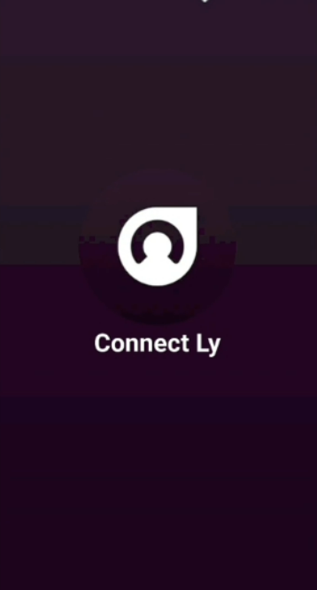
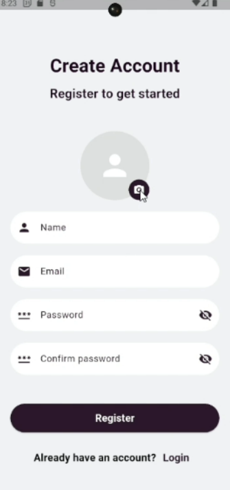
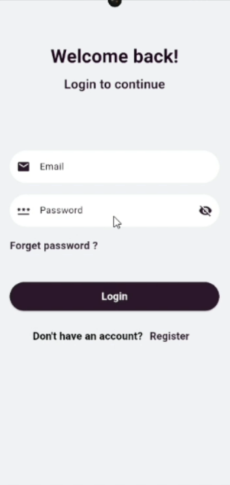
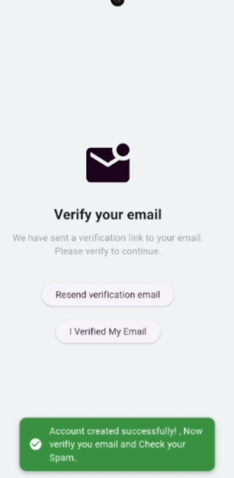
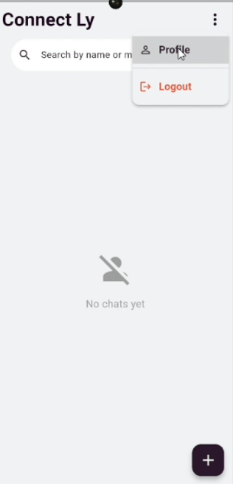
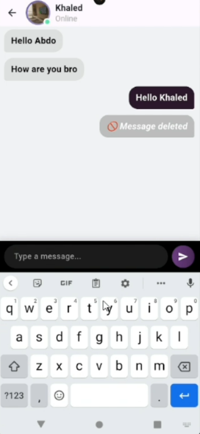
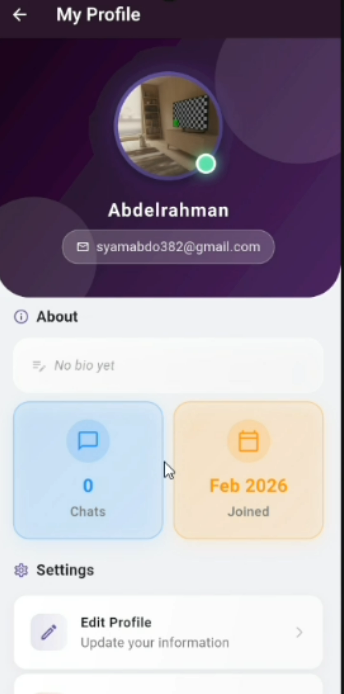

# 💬 Connectly — Real-Time Chat Application

> A fully-featured real-time chat app built independently with Flutter.  
> From authentication to live messaging — built from scratch without following any course.

---

## 🎬 Live Demo

[](https://www.linkedin.com/posts/abdelrahman-siam-2a66072ba_flutter-flutterdeveloper-mobiledevelopment-activity-7426707975953600513-SgXZ?utm_source=share&utm_medium=member_desktop&rcm=ACoAAEye2N4BxN3uf6ODo-UmeBYhDCm2KCGqw30)

---

## 📱 Screenshots

| Register | Login | Email Verification |
|:--------:|:-----:|:-----------------:|
|  |  |  |  |

| Home | Available Users | Chat |
|:----:|:--------------:|:----:|
|  |  |  |

| Profile | Edit Profile | Logout Dialog |
|:-------:|:-----------:|:-------------:|
|  |  |  |

---

## ✨ Features

### 🔐 Authentication
- Register with full validation
- Email & password login
- Email verification flow
- Forgot password
- Logout with confirmation dialog

### 💬 Messaging
- Real-time chat via Firebase Firestore
- Message send / edit / delete
- Online/offline user status
- Chat history persistence

### 👤 Profile
- View profile (name, bio, conversation count)
- Edit profile info
- Profile image upload via camera or gallery
- Image stored on Supabase Storage

### 🔔 Notifications
- Push notifications via Firebase Cloud Messaging (FCM)
- Receive messages when app is in background

### ✅ Validation
- All forms have complete field validation
- Email format validation
- Password strength validation
- Empty field handling
- Real-time error feedback

---

## 🏗️ Architecture

```
lib/
├── core/
│   ├── di/              # Dependency injection (get_it)
│   ├── routing/         # GoRouter navigation
│   ├── theme/           # App colors & theme
│   └── utils/           # Helpers & constants
│
└── features/
    ├── auth/
    │   ├── data/        # Firebase Auth datasource & repository impl
    │   ├── domain/      # Auth entities, repository interface, use cases
    │   └── presentation/# Login, Register, Verify screens + Cubit
    ├── chat/
    │   ├── data/        # Firestore datasource & repository impl
    │   ├── domain/      # Message entity, repository interface, use cases
    │   └── presentation/# Chat screen + Cubit
    ├── profile/
    │   ├── data/        # Supabase storage + Firestore datasource
    │   ├── domain/      # Profile entity, repository interface, use cases
    │   └── presentation/# Profile, Edit Profile screens + Cubit
    └── home/
        ├── data/
        ├── domain/
        └── presentation/# Home, Available Users screens + Cubit
```

### Data Flow

```
UI → Cubit → UseCase → Repository (interface)
                            ↓
                    RepositoryImpl → Firebase / Supabase
```

---

## 🛠️ Tech Stack

| Category | Technology | Purpose |
|----------|-----------|---------|
| State Management | flutter_bloc (Cubit) | Predictable state management |
| DI | get_it | Service locator |
| Navigation | go_router | Declarative routing |
| Auth | firebase_auth | User authentication |
| Database | cloud_firestore | Real-time messages & user data |
| Storage | supabase_flutter | Profile image storage |
| Notifications | firebase_messaging | Push notifications (FCM) |
| Image | image_picker | Camera & gallery picker |
| Animations | flutter_animate | Smooth UI animations |
| Date | intl | Message timestamp formatting |

---

## 🔥 Firebase Setup

The app uses the following Firebase services:

| Service | Usage |
|---------|-------|
| Firebase Auth | Register, Login, Email Verification |
| Cloud Firestore | Messages, User profiles, Online status |
| Firebase Messaging | Push notifications |

### Firestore Structure

```
users/
└── {uid}/
    ├── name
    ├── email
    ├── bio
    ├── imageUrl
    ├── isOnline
    └── conversationCount

messages/
└── {chatId}/
    └── messages/
        └── {messageId}/
            ├── text
            ├── senderId
            ├── timestamp
            └── isEdited
```

---

## 📦 Supabase Setup

Profile images are stored in **Supabase Storage**:

```
Storage Bucket: avatars/
└── {uid}.jpg
```

---

## 🚀 Getting Started

### Prerequisites
```
Flutter SDK >= 3.6.0
Dart SDK ^3.6.0
Firebase project configured
Supabase project configured
```

### Installation

```bash
# 1. Clone the repository
git clone https://github.com/AbdelrahmanSiam/connectly_app.git

# 2. Navigate to project
cd connectly_app

# 3. Install dependencies
flutter pub get

# 4. Add your Firebase config
# Download google-services.json → android/app/
# Download GoogleService-Info.plist → ios/Runner/

# 5. Add your Supabase config in main.dart
# supabaseUrl and supabaseAnonKey

# 6. Run
flutter run
```

---

## 👨‍💻 Author

**Abdelrahman Siam**  
Flutter Mobile Application Developer

[](https://linkedin.com/in/abdelrahman-siam-2a66072ba)
[](https://github.com/AbdelrahmanSiam)

📧 syamabdo382@gmail.com  
📱 +201282387620
